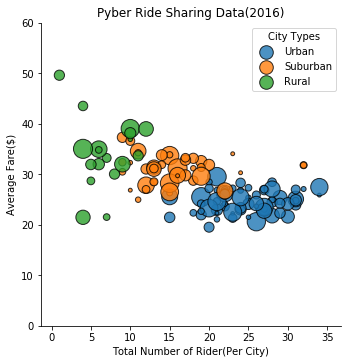
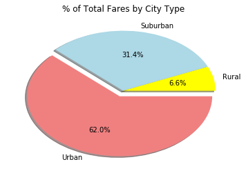
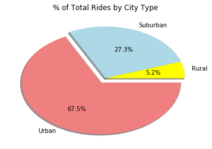
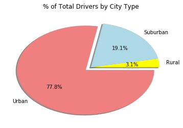

<h1> Oberservations </h1>

<ol>
<li> Number of Rides in the Urban cities was more compared to Rural area. </li>
<li> Even thought city wise Average Fares were higher in he Rural vs Urban, but the total Fare was higher Urban Cities. </li> 
<li> Suburban ares had better of both, more rides and higher fares, but the fares weren't much higher than the Urban areas, so the Total Fare collection was higher in the Urban cities. </li>    
</ol> 


```python
import pandas as pd
import numpy as np
import os
import matplotlib.pyplot as plt
import seaborn as sns
```


```python
cityPath = os.path.join("raw_data", "city_data.csv")
ridePath = os.path.join("raw_data", "ride_data.csv")

city_data = pd.read_csv(cityPath)
ride_data = pd.read_csv(ridePath)
```


```python
# city_data.head(), ride_data.head()
```


```python
avg_fare_by_city = ride_data.groupby("city")["fare"].mean().reset_index()

```


```python
avg_fare_by_city.columns = ["city","avg_fare"]
```


```python
# avg_fare_by_city.head()
```


```python
rides_by_city = ride_data.groupby("city")["ride_id"].count().reset_index()
rides_by_city.columns = ["city","number_of_rides"]
```


```python
# rides_by_city.head()
```


```python
# driver count by city was given in this data, but just in case of duplicates
drivers_by_city = city_data.groupby("city")["driver_count"].sum().reset_index()  
drivers_by_city.columns = ["city","driver_count"]
# drivers_by_city.head()
```


```python
city_sum_inter = pd.merge(avg_fare_by_city,rides_by_city,on="city")
city_sum = pd.merge(city_sum_inter,city_data,on="city")
city_sum.head()
bp_city_sum = city_sum.drop(columns="city").reset_index(drop=True)
bp_city_sum = city_sum.drop(columns="city").reset_index(drop=True)
bp_city_sum.head()
```


<div>
<style scoped>
    .dataframe tbody tr th:only-of-type {
        vertical-align: middle;
    }

    .dataframe tbody tr th {
        vertical-align: top;
    }

    .dataframe thead th {
        text-align: right;
    }
</style>
<table border="1" class="dataframe">
  <thead>
    <tr style="text-align: right;">
      <th></th>
      <th>avg_fare</th>
      <th>number_of_rides</th>
      <th>driver_count</th>
      <th>type</th>
    </tr>
  </thead>
  <tbody>
    <tr>
      <th>0</th>
      <td>23.928710</td>
      <td>31</td>
      <td>21</td>
      <td>Urban</td>
    </tr>
    <tr>
      <th>1</th>
      <td>20.609615</td>
      <td>26</td>
      <td>67</td>
      <td>Urban</td>
    </tr>
    <tr>
      <th>2</th>
      <td>37.315556</td>
      <td>9</td>
      <td>16</td>
      <td>Suburban</td>
    </tr>
    <tr>
      <th>3</th>
      <td>23.625000</td>
      <td>22</td>
      <td>21</td>
      <td>Urban</td>
    </tr>
    <tr>
      <th>4</th>
      <td>21.981579</td>
      <td>19</td>
      <td>49</td>
      <td>Urban</td>
    </tr>
  </tbody>
</table>
</div>


```python
fare_range_int = (city_sum["avg_fare"].max() - city_sum["avg_fare"].min())/10
fare_min = city_sum["avg_fare"].min()
fare_max = city_sum["avg_fare"].max()
y_axis = np.arange(fare_min, fare_max , fare_range_int)
```


```python
# plt.scatter(city_sum["number_of_rides"], city_sum["avg_fare"], marker="o", facecolors="red", 
#             edgecolors="black", s=city_sum["driver_count"] * 5, alpha=1)
# plt.figure(figsize=(20,10))
sns.lmplot(x="number_of_rides", y="avg_fare", data=bp_city_sum, hue="type", fit_reg=False,  
           scatter_kws={'s':bp_city_sum["driver_count"] * 5, 'edgecolor':'black'}, legend=False)
plt.xlabel("Total Number of Rider(Per City)")
plt.ylabel("Average Fare($)")
plt.legend(title="City Types", loc="upper right")
plt.title("Pyber Ride Sharing Data(2016)")
plt.ylim(0,60)


```


    (0, 60)


    <matplotlib.figure.Figure at 0x1a1f47f7b8>





```python
total_fare = ride_data["fare"].sum()
total_fare
```


    63651.31


```python
city_ride_data = pd.merge(city_data,ride_data,on="city")
city_ride_data.head()
```


<div>
<style scoped>
    .dataframe tbody tr th:only-of-type {
        vertical-align: middle;
    }

    .dataframe tbody tr th {
        vertical-align: top;
    }

    .dataframe thead th {
        text-align: right;
    }
</style>
<table border="1" class="dataframe">
  <thead>
    <tr style="text-align: right;">
      <th></th>
      <th>city</th>
      <th>driver_count</th>
      <th>type</th>
      <th>date</th>
      <th>fare</th>
      <th>ride_id</th>
    </tr>
  </thead>
  <tbody>
    <tr>
      <th>0</th>
      <td>Kelseyland</td>
      <td>63</td>
      <td>Urban</td>
      <td>2016-08-19 04:27:52</td>
      <td>5.51</td>
      <td>6246006544795</td>
    </tr>
    <tr>
      <th>1</th>
      <td>Kelseyland</td>
      <td>63</td>
      <td>Urban</td>
      <td>2016-04-17 06:59:50</td>
      <td>5.54</td>
      <td>7466473222333</td>
    </tr>
    <tr>
      <th>2</th>
      <td>Kelseyland</td>
      <td>63</td>
      <td>Urban</td>
      <td>2016-05-04 15:06:07</td>
      <td>30.54</td>
      <td>2140501382736</td>
    </tr>
    <tr>
      <th>3</th>
      <td>Kelseyland</td>
      <td>63</td>
      <td>Urban</td>
      <td>2016-01-25 20:44:56</td>
      <td>12.08</td>
      <td>1896987891309</td>
    </tr>
    <tr>
      <th>4</th>
      <td>Kelseyland</td>
      <td>63</td>
      <td>Urban</td>
      <td>2016-08-09 18:19:47</td>
      <td>17.91</td>
      <td>8784212854829</td>
    </tr>
  </tbody>
</table>
</div>


```python
fare_by_city_type = city_ride_data.groupby("type")["fare"].sum().reset_index()
fare_by_city_type.columns = ["type", "total_fare_city"]
fare_by_city_type["percent_fare_by_city_type"] = pd.to_numeric(fare_by_city_type["total_fare_city"] * 100 / total_fare)
```


```python
fare_by_city_type
```


<div>
<style scoped>
    .dataframe tbody tr th:only-of-type {
        vertical-align: middle;
    }

    .dataframe tbody tr th {
        vertical-align: top;
    }

    .dataframe thead th {
        text-align: right;
    }
</style>
<table border="1" class="dataframe">
  <thead>
    <tr style="text-align: right;">
      <th></th>
      <th>type</th>
      <th>total_fare_city</th>
      <th>percent_fare_by_city_type</th>
    </tr>
  </thead>
  <tbody>
    <tr>
      <th>0</th>
      <td>Rural</td>
      <td>4255.09</td>
      <td>6.68500</td>
    </tr>
    <tr>
      <th>1</th>
      <td>Suburban</td>
      <td>20335.69</td>
      <td>31.94858</td>
    </tr>
    <tr>
      <th>2</th>
      <td>Urban</td>
      <td>40078.34</td>
      <td>62.96546</td>
    </tr>
  </tbody>
</table>
</div>


```python
rides_by_city_type = city_ride_data.groupby("type")["ride_id"].count().reset_index()
rides_by_city_type.columns = ["type","rides_by_city_type"]
rides_by_city_type["percent_rides_by_city_type"] = pd.to_numeric(rides_by_city_type["rides_by_city_type"] * 100 / len(city_ride_data))
```


```python
rides_by_city_type
```


<div>
<style scoped>
    .dataframe tbody tr th:only-of-type {
        vertical-align: middle;
    }

    .dataframe tbody tr th {
        vertical-align: top;
    }

    .dataframe thead th {
        text-align: right;
    }
</style>
<table border="1" class="dataframe">
  <thead>
    <tr style="text-align: right;">
      <th></th>
      <th>type</th>
      <th>rides_by_city_type</th>
      <th>percent_rides_by_city_type</th>
    </tr>
  </thead>
  <tbody>
    <tr>
      <th>0</th>
      <td>Rural</td>
      <td>125</td>
      <td>5.193187</td>
    </tr>
    <tr>
      <th>1</th>
      <td>Suburban</td>
      <td>657</td>
      <td>27.295388</td>
    </tr>
    <tr>
      <th>2</th>
      <td>Urban</td>
      <td>1625</td>
      <td>67.511425</td>
    </tr>
  </tbody>
</table>
</div>


```python
drivers_by_city_type = city_data.groupby("type")["driver_count"].sum().reset_index()
drivers_by_city_type.columns = ["type","drivers_by_city_type"]
drivers_by_city_type["percent_drivers_by_city_type"] = pd.to_numeric(drivers_by_city_type["drivers_by_city_type"] * 100/ city_data["driver_count"].sum())
drivers_by_city_type
```


<div>
<style scoped>
    .dataframe tbody tr th:only-of-type {
        vertical-align: middle;
    }

    .dataframe tbody tr th {
        vertical-align: top;
    }

    .dataframe thead th {
        text-align: right;
    }
</style>
<table border="1" class="dataframe">
  <thead>
    <tr style="text-align: right;">
      <th></th>
      <th>type</th>
      <th>drivers_by_city_type</th>
      <th>percent_drivers_by_city_type</th>
    </tr>
  </thead>
  <tbody>
    <tr>
      <th>0</th>
      <td>Rural</td>
      <td>104</td>
      <td>3.105405</td>
    </tr>
    <tr>
      <th>1</th>
      <td>Suburban</td>
      <td>638</td>
      <td>19.050463</td>
    </tr>
    <tr>
      <th>2</th>
      <td>Urban</td>
      <td>2607</td>
      <td>77.844133</td>
    </tr>
  </tbody>
</table>
</div>


```python
# type(rides_by_city_type),type(fare_by_city_type)
type_data_inter = pd.merge(rides_by_city_type,fare_by_city_type,on="type")
type_data = pd.merge(type_data_inter,drivers_by_city_type,on="type")
type_data
```


<div>
<style scoped>
    .dataframe tbody tr th:only-of-type {
        vertical-align: middle;
    }

    .dataframe tbody tr th {
        vertical-align: top;
    }

    .dataframe thead th {
        text-align: right;
    }
</style>
<table border="1" class="dataframe">
  <thead>
    <tr style="text-align: right;">
      <th></th>
      <th>type</th>
      <th>rides_by_city_type</th>
      <th>percent_rides_by_city_type</th>
      <th>total_fare_city</th>
      <th>percent_fare_by_city_type</th>
      <th>drivers_by_city_type</th>
      <th>percent_drivers_by_city_type</th>
    </tr>
  </thead>
  <tbody>
    <tr>
      <th>0</th>
      <td>Rural</td>
      <td>125</td>
      <td>5.193187</td>
      <td>4255.09</td>
      <td>6.68500</td>
      <td>104</td>
      <td>3.105405</td>
    </tr>
    <tr>
      <th>1</th>
      <td>Suburban</td>
      <td>657</td>
      <td>27.295388</td>
      <td>20335.69</td>
      <td>31.94858</td>
      <td>638</td>
      <td>19.050463</td>
    </tr>
    <tr>
      <th>2</th>
      <td>Urban</td>
      <td>1625</td>
      <td>67.511425</td>
      <td>40078.34</td>
      <td>62.96546</td>
      <td>2607</td>
      <td>77.844133</td>
    </tr>
  </tbody>
</table>
</div>


```python
colors = ["yellow","lightblue","lightcoral"]

explode = (0,0,0.1)

plt.pie(type_data["percent_fare_by_city_type"], explode=explode, labels=type_data["type"], colors=colors,
        autopct="%1.1f%%",shadow=True, )
plt.title("% of Total Fares by City Type")
```


    Text(0.5,1,'% of Total Fares by City Type')





```python
plt.pie(type_data["percent_rides_by_city_type"], explode=explode, labels=type_data["type"], colors=colors,
        autopct="%1.1f%%",shadow=True, )
plt.title("% of Total Rides by City Type")
```


    Text(0.5,1,'% of Total Rides by City Type')





```python
plt.pie(type_data["percent_drivers_by_city_type"], explode=explode, labels=type_data["type"], colors=colors,
        autopct="%1.1f%%",shadow=True, )
plt.title("% of Total Drivers by City Type")
```


    Text(0.5,1,'% of Total Drivers by City Type')




